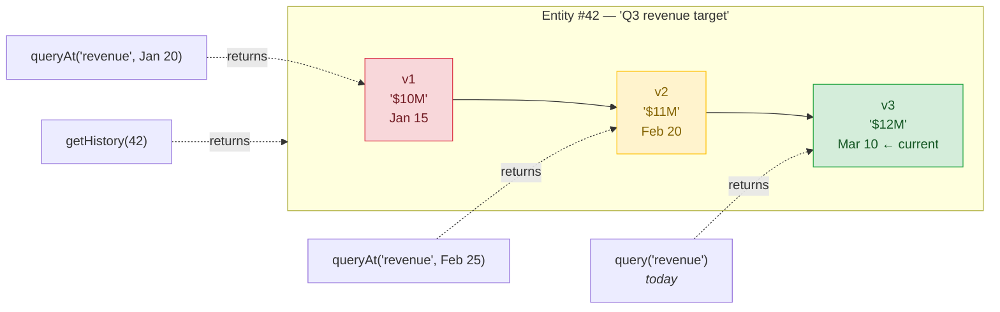
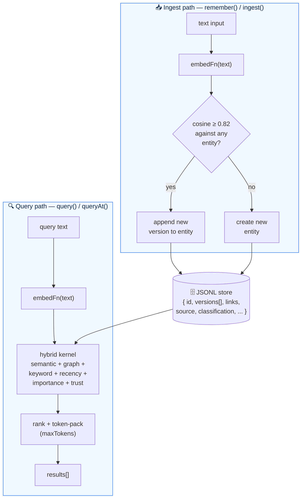
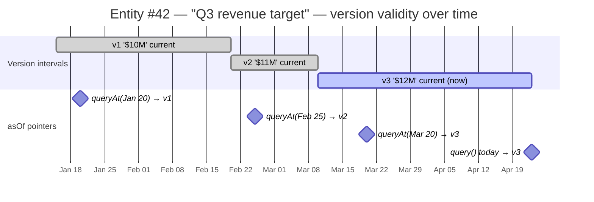

# Kalairos

[](https://www.npmjs.com/package/kalairos)
[](https://www.npmjs.com/package/kalairos)
[](https://github.com/LabsKrishna/kalairos/blob/main/LICENSE)
[](https://www.npmjs.com/package/kalairos)

> Durable, private, time-aware memory for long-running AI agents.

Your agent stores a fact. Updates it. Then asks *"what was true last week?"* A vector DB forgets the old embedding. **Kalairos remembers — with a full version trail.**

📦 **[npmjs.com/package/kalairos](https://www.npmjs.com/package/kalairos)** · 🐙 **[GitHub](https://github.com/LabsKrishna/kalairos)** · 📬 **main@krishnalabs.ai**

```bash
npm install kalairos
```

No cloud service. No API key required (bring any embedder, or start with the bundled one). JSONL on disk — human-readable, git-friendly.

---

## Quick start — connect in under 10 lines

The minimum you need to store a fact, update it, and query it back. No API key, no cloud, no agent abstractions yet.

```js
const kalairos = require('kalairos');
const embed = async (t) => [...t].map(c => c.charCodeAt(0) / 255); // toy embedder

await kalairos.init({ embedFn: embed });

await kalairos.remember('Revenue target is $10M for Q3');
await kalairos.remember('Revenue target revised to $12M for Q3');

const { results } = await kalairos.query('revenue target');
console.log(results[0].text);                            // → "Revenue target revised to $12M for Q3"

const then = Date.now() - 7 * 24 * 60 * 60 * 1000;
const past = await kalairos.queryAt('revenue target', then);
console.log(past.results[0].text);                       // → "Revenue target is $10M for Q3" (the original)
```

That's memory with time travel. Swap the toy embedder for OpenAI, Cohere, or any `async (text) => number[]` when you're ready. For agent-shaped APIs (identity, default tags, recall/boot helpers), see [Agent API](#agent-api) below.

**Try the interactive demo — zero config:**

```bash
npx kalairos demo
```

---

## API stability

Kalairos follows semver. Within the `1.x` line, the signatures of **`init`, `ingest`, `remember`, `query`, `getHistory`** — and their agent-shaped aliases on `createAgent()` — are **frozen**. Additive fields (new optional opts, new response keys) are fine and land in minor releases; any breaking change bumps the major version. Deprecated APIs emit warnings for at least two minor versions before removal.

---

## Why not just use a vector database?

|                                | Vector DB              | Kalairos                               |
| ------------------------------ | ---------------------- | ------------------------------------ |
| **Updates**                    | Overwrite or duplicate | Automatic versioning                 |
| **History**                    | None                   | Full version trail with deltas       |
| **"What was true on Jan 15?"** | Can't answer           | `asOf` any timestamp                 |
| **Contradictions**             | Invisible              | Auto-detected between versions       |
| **Provenance**                 | Not tracked            | Who stored it, when, from where      |
| **Retrieval**                  | Cosine similarity      | Semantic + graph + keyword + recency |
| **Deployment**                 | Cloud SDK              | Local-first, zero cloud dependency   |
| **Embedding model**            | Bundled or locked in   | BYO — any provider, any model        |

### How time-travel works

One entity, many versions. Every query — whether "now" or `asOf` a past date — picks the version that was current at that moment. A vector DB can't do this: it only knows the last write.



Each version carries its own `text`, `delta` (what changed), `timestamp`, `source`, and graph edges. Updates never overwrite — they append. Deletes are soft by default. Everything is auditable.

---

## Benchmarks

All numbers from `npm run bench` — deterministic bag-of-words embedder, no API key needed. Reproducible on any machine.

| Metric                      | Score                            | What it measures                                      |
| --------------------------- | -------------------------------- | ----------------------------------------------------- |
| **Recall@5**                | 75% (finance), 50% (engineering) | Fraction of relevant items in top-5 results           |
| **Precision@3**             | 100% (health)                    | Fraction of top-3 results that are relevant           |
| **MRR**                     | 1.0                              | First relevant result appears at rank 1               |
| **Temporal accuracy**       | 100%                             | `asOf` time-travel returns correct historical version |
| **Contradiction detection** | 100%                             | Value changes flagged across all scenarios            |
| **Cross-session recall**    | 100%                             | Agent B finds Agent A's memories                      |
| **Noise separation**        | 3/5 finance in top-5             | Relevant entities ranked above unrelated noise        |

**Constitution Goal Scorecard: 10/10 goals, 53/53 assertions passing (100%)**

These numbers use a bag-of-words embedder (no neural model). With OpenAI `text-embedding-3-small` or Cohere embeddings, expect recall@5 > 90%. See `bench/agent-memory/bench-eval-real.js` for a variant that uses real embeddings.

```bash
npm run bench          # full suite (53 tests, ~300ms)
npm run bench:real     # real embeddings (requires OPENAI_API_KEY)
```

---

## Agent API

`createAgent()` is the recommended interface. It wraps the core engine with agent identity, default classification, default tags, and a clean `remember / recall / update` surface.

```js
const agent = kalairos.createAgent({
	name: 'budget-planner',
	defaultClassification: 'confidential',
	defaultTags: ['finance'],
});

const id = await agent.remember('Q2 budget is 2.4M');
await agent.update('Q2 budget is now 2.7M');

const { results } = await agent.recall('Q2 budget');
const past = await agent.recallAt('Q2 budget', Date.now() - 7 * 24 * 60 * 60 * 1000);

const history = await agent.getHistory(id);
const { contradictions } = await agent.getContradictions(id);
```

| Method                                  | What it does                                                      |
| --------------------------------------- | ----------------------------------------------------------------- |
| `agent.remember(text, opts?)`           | Store or update a fact (version detection is automatic)           |
| `agent.update(text, opts?)`             | Alias for `remember` — makes update intent explicit               |
| `agent.recall(text, opts?)`             | Query current memories (supports `maxTokens`, `filter`, `limit`)  |
| `agent.recallAt(text, timestamp)`       | Time-travel query — returns each entity's version current at `t`  |
| `agent.recallRange(text, since, until)` | Entities whose version timeline overlaps `[since, until]`         |
| `agent.boot(opts?)`                     | Token-budgeted startup context (no query vector needed)           |
| `agent.getHistory(id)`                  | Full version history with provenance trail                        |
| `agent.getContradictions(id)`           | Versions flagged as contradictory                                 |

> **Note:** `recall` does **not** accept `asOf`; it throws `ERR_VALIDATION` if you pass time arguments. Use `recallAt(text, timestamp)` or `recallRange(text, since, until)` for time-scoped queries. See [Agent integration templates](#agent-integration-templates) below for full boot + recall + LLM wiring.

---

## Core capabilities

### How data flows — ingest, store, query

Both write and read paths share the same embedder and the same JSONL store. On ingest, a similarity check decides "new version of an existing entity?" vs "brand-new entity." On query, the hybrid kernel scores every candidate against a fresh query embedding.



The similarity threshold for version detection is `KALAIROS_VERSION_THRESHOLD` (default `0.82`). Lower it if updates keep creating duplicates; raise it if unrelated facts keep getting merged. See [Troubleshooting](#troubleshooting) for concrete symptoms.

### Versioned memory

Every update creates a version, never an overwrite. Each version records the new content, a delta summary describing the change, a timestamp, source provenance, classification, and a snapshot of graph edges at that point in time.

### Time-travel queries

Use `queryAt(text, timestamp)` for a point-in-time snapshot, or `queryRange(text, since, until)` for entities whose version timeline overlaps a range. Entities that didn't exist yet are skipped. Each entity is scored against the version current at that timestamp.

Think of an entity's version history as a sequence of intervals on a timeline. Every version is "current" from its own timestamp until the next version supersedes it. A `queryAt(t)` call drops a pointer onto the timeline and returns whichever version was current at that moment:



```js
// Point-in-time snapshot
const snapshot = await kalairos.queryAt(
	'raw material cost',
	new Date('2026-01-15').getTime(),
);

// Range query — entities active between these bounds
const window = await kalairos.queryRange(
	'raw material cost',
	new Date('2026-01-01').getTime(),
	new Date('2026-01-31').getTime(),
);
```

Note: Kalairos versions are **linear per entity** — each new version supersedes the previous one; there is no branching/forking. The "fork" effect happens *across* entities: when a `remember()` falls below the similarity threshold, it creates a new entity rather than a new version, so related-but-distinct facts live side-by-side in the store instead of being collapsed together. Linearity is a deliberate design choice, not a limitation: it's what keeps `asOf:` queries well-defined — there is always one unambiguous answer to "what did we believe about entity X at time T."

### Contradiction detection

When a version contradicts a previous one (e.g. a price changes from $200 to $250), the delta is flagged. Agents can inspect contradictions and decide how to act.

### Provenance and classification

Every entity tracks `source` (who created it) and `classification` (how sensitive it is). Query results include both so downstream systems can make trust decisions.

```js
await kalairos.ingest('Customer requested a refund', {
	source: { type: 'tool', uri: 'support-ticket-1234' },
	classification: 'confidential',
	tags: ['support', 'billing'],
});
```

### Retention and deletion

- **Soft delete**: `remove(id, { deletedBy })` — excluded from queries, preserved for audit
- **Hard delete**: `purge(id)` — permanent erasure for right-to-erasure workflows (GDPR)
- **Retention policy**: `{ policy: "keep" | "expire", expiresAt }` per entity

### Memory types and workspaces

Tag entities with `memoryType` (`"short-term"`, `"long-term"`, `"working"`) and `workspaceId` for tenant isolation. Both are filterable in queries.

```js
await kalairos.remember('Meeting notes from standup', {
	memoryType: 'short-term',
	workspaceId: 'team-alpha',
});
```

### Hybrid scoring

Every result's final score is a weighted sum scaled by trust:

```
raw   = semantic + graphBoost + kwBoost + llmBoost + importanceBoost + recencyBoost
final = min(1, raw × trustMultiplier)
```

Two cutoffs apply: `semantic < KALAIROS_MIN_SEMANTIC` (default `0.35`) is a **hard floor** — the entity is dropped before boosts are even computed. Then `final < KALAIROS_MIN_SCORE` (default `0.45`) is a second cutoff after all boosts.

| Signal              | Formula                                                     | Default weight | Max contribution | Env var                          |
| ------------------- | ----------------------------------------------------------- | -------------- | ---------------- | -------------------------------- |
| **Semantic**        | `cosine(queryVec, entityVec)`                               | n/a (backbone) | +1.00            | —                                |
| **Graph boost**     | `min(links, 10) × w`                                        | `0.01`         | +0.10            | `KALAIROS_GRAPH_BOOST`           |
| **Keyword boost**   | `(termsMatched / totalTerms) × w`                           | `0.05`         | +0.05            | (internal)                       |
| **LLM boost**       | `(llmKwMatched / totalTerms) × w` (only with `useLLM:true`) | `0.08`         | +0.08            | `KALAIROS_LLM_BOOST`             |
| **Importance**      | `importance × w`                                            | `0.05`         | +0.05            | `KALAIROS_IMPORTANCE_WEIGHT`     |
| **Recency**         | `w × exp(−ln2 × age / halfLife)` (disabled in `asOf` mode)  | `0.10` / 30d   | +0.10            | `KALAIROS_RECENCY_WEIGHT`, `KALAIROS_RECENCY_HALFLIFE_DAYS` |
| **Trust multiplier**| `1 − tw + tw × trust` (opt-in, `tw = 0` by default)         | `0`            | ×1.0 (no effect) | (set via `init({ trustWeight })`) |

### Worked example — two entities competing for one query

Query: `"Q3 revenue target"` (3 terms: `q3`, `revenue`, `target`)

Two candidates in the store:

| # | Text                                          | Semantic | Links | Keyword matches   | Importance | Age   |
| - | --------------------------------------------- | -------- | ----- | ----------------- | ---------- | ----- |
| A | "Q3 revenue target revised to $12M"           | `0.78`   | 4     | 3/3 (all match)   | `0.6`      | 2 d   |
| B | "Q2 budget was $2.4M — similar to Q3 outlook" | `0.72`   | 1     | 1/3 (only `q3`)   | `0.2`      | 60 d  |

Computing each term with defaults (`useLLM: false`, `trustWeight: 0`):

```
── Entity A ─────────────────────────────────────────────────────────
  semantic        = 0.78
  graphBoost      = min(4, 10) × 0.01     = 0.04
  kwBoost         = (3/3)      × 0.05     = 0.05
  llmBoost        = 0                     = 0.00
  importanceBoost = 0.6        × 0.05     = 0.03
  recencyBoost    = 0.10 × exp(-ln2 × 2/30) ≈ 0.0955
  raw             = 0.78 + 0.04 + 0.05 + 0.03 + 0.0955 ≈ 0.9955
  final           = min(1, 0.9955 × 1.0)   ≈ 1.00   ✅ kept

── Entity B ─────────────────────────────────────────────────────────
  semantic        = 0.72
  graphBoost      = min(1, 10) × 0.01     = 0.01
  kwBoost         = (1/3)      × 0.05     ≈ 0.0167
  llmBoost        = 0                     = 0.00
  importanceBoost = 0.2        × 0.05     = 0.01
  recencyBoost    = 0.10 × exp(-ln2 × 60/30) = 0.10 × 0.25 = 0.025
  raw             = 0.72 + 0.01 + 0.0167 + 0.01 + 0.025   ≈ 0.7817
  final           ≈ 0.78                                  ✅ kept

→ A ranks above B (1.00 vs 0.78). Keyword match + recency + importance stack.
```

**What each signal is for:**

- **Semantic** carries the result. If embeddings disagree, no boost can save it (hard-floored at 0.35).
- **Graph boost** rewards entities woven into the knowledge graph — a fact referenced by many others. Caps at 10 links so hubs don't dominate.
- **Keyword boost** is the cheap fallback when embeddings are weak (short queries, toy embedder, typos).
- **LLM boost** extends keyword matching to LLM-extracted terms (synonyms, tags). Zero cost when `useLLM: false` — the branch is skipped entirely.
- **Importance** is the agent's explicit lever. Use it for policies, credentials, user preferences — memories that should surface even with mediocre semantic fit.
- **Recency** favors fresh facts. Auto-disabled under `queryAt`/`queryRange` — historical queries must not be biased by "how recently we learned it."
- **Trust** is opt-in. Set `trustWeight > 0` in `init()` to down-weight low-trust sources (poisoning defense). With the default `0`, behavior is byte-identical to the pre-trust kernel.

Set importance explicitly to prioritize critical memories in tight token budgets:

```js
await kalairos.remember('API key rotation policy: every 90 days', { importance: 0.9 });
await kalairos.remember('Office wifi password is "guest123"', { importance: 0.2 });
```

Every query result carries its decomposed scores (`semantic`, `recency`, `llmBoost`, `importanceBoost`, `trust`, `trustMultiplier`) so you can debug exactly why a result ranked where it did.

### Error signals

Structured errors that agents can subscribe to for adaptive behavior:

```js
kalairos.onSignal('ERR_EMBEDDING_FAILED', (err) => {
	console.warn(err.message, '—', err.suggestion);
});
```

### LLM enrichment

Pass `llmFn` to `init()` for optional metadata extraction on ingest. When `useLLM: true` is set, the LLM extracts keywords, context, semantic tags, and importance scores. Off by default. Failures are non-blocking.

```js
await kalairos.init({
	embedFn: myEmbedder,
	llmFn: async (text, type) => ({
		keywords: ['budget', 'Q2'],
		context: 'Quarterly budget update',
		llmTags: ['finance', 'planning'],
		importance: 0.8,
	}),
});

await kalairos.remember('Q2 budget is 2.4M', { useLLM: true });
```

---

## Use-case examples

Three sketches of how Kalairos shows up in real agents. Each one leans on a different differentiator — contradictions, time-travel, provenance — not just "store and recall."

### 1. Customer support bot — contradictions + provenance

A support agent talks to the same customer across multiple tickets. Facts change: the product they own, the plan they're on, the issue they reported. Kalairos flags the contradiction automatically and keeps every source.

```js
const support = kalairos.createAgent({
  name: 'support-bot',
  defaultClassification: 'confidential',
  defaultTags: ['support'],
});

// Ticket #4821 — first touch
await support.remember('Customer reports checkout is broken on mobile', {
  source: { type: 'tool', uri: 'zendesk:4821' },
  importance: 0.7,
});

// Ticket #4830 — follow-up, customer clarified it's desktop only
const id = await support.remember(
  'Customer reports checkout is broken on desktop (not mobile)',
  { source: { type: 'tool', uri: 'zendesk:4830' } }
);

// Before replying, surface any contradictions
const { contradictions } = await support.getContradictions(id);
if (contradictions.length) {
  // Each version carries the source that asserted it — use it to cite back
  contradictions.forEach(v => {
    console.log(`${v.delta.summary} (from ${v.source?.uri})`);
  });
}

// Hand the agent the full trail so its reply can acknowledge the change
const { results } = await support.recall('checkout broken', { maxTokens: 1500 });
```

Why this matters: a vector DB would silently overwrite the first ticket or store both as unrelated — the agent would contradict itself or miss the update. Kalairos versions, flags the conflict, and hands back both sources so the reply can say *"I see you mentioned mobile earlier, but your latest ticket says desktop — confirming."*

### 2. Code review agent — time-travel + importance

A long-running review agent tracks team conventions across a repo. Rules change. The agent needs to answer: *"What was the team's linting policy when PR #412 was merged?"* — not today's policy.

```js
const reviewer = kalairos.createAgent({
  name: 'review-bot',
  defaultTags: ['team-conventions'],
});

// Policies as they're decided
await reviewer.remember('No default exports in TS files', { importance: 0.9 });
await reviewer.remember('Prefer async/await over .then() chains', { importance: 0.8 });
await reviewer.remember('100-char line limit', { importance: 0.5 });

// Months later the team relaxes the line limit
await reviewer.remember('120-char line limit (updated from 100)', { importance: 0.5 });

// Reviewing an old PR — what did the rules say THEN?
const mergedAt = new Date('2026-02-01').getTime();
const pastRules = await reviewer.recallAt('line limit', mergedAt);
console.log(pastRules.results[0].text); // → "100-char line limit"

// Today's review — what's current?
const currentRules = await reviewer.recall('line limit');
console.log(currentRules.results[0].text); // → "120-char line limit (updated from 100)"
```

Why this matters: the agent never accuses past PRs of violating rules that didn't exist yet. `recallAt(t)` disables recency boost automatically, so the score isn't biased toward "newer = better." High-importance rules (`0.9`) still rise above low-importance ones (`0.5`) inside tight token budgets.

### 3. Research assistant — bitemporal queries + provenance chains

A research agent reads papers, blog posts, and tweets. The trustworthiness of these sources is wildly different. The agent's *current belief* should weight them accordingly — and a human reviewer must be able to trace any claim back to its origin.

```js
const research = kalairos.createAgent({
  name: 'research-agent',
  defaultClassification: 'internal',
});

// A peer-reviewed source
await research.remember('GPT-4 training cutoff is April 2023', {
  source: { type: 'paper', uri: 'arxiv:2303.08774' },
  importance: 0.9,
});

// A less reliable blog
await research.remember('GPT-4 training cutoff is December 2023', {
  source: { type: 'blog', uri: 'randomblog.com/gpt4' },
  importance: 0.3,
});

// Ask a question — inspect why each result surfaced
const { results } = await research.recall('GPT-4 training cutoff');
for (const r of results) {
  console.log(`"${r.text}"`);
  console.log(`  source: ${r.source?.uri}  score=${r.score}  trust=${r.trust}`);
}

// Three months later — regenerate the research report as the agent believed it then
const reportDate = Date.now() - 90 * 24 * 60 * 60 * 1000;
const pastBelief = await research.recallAt('GPT-4 training cutoff', reportDate);
```

Why this matters: every returned fact carries its `source`, `classification`, and score breakdown — so a human reviewer can audit *why* a claim surfaced. Opt into trust weighting (`init({ trustWeight: 0.3 })`) to have low-trust sources ranked below high-trust ones even when semantically similar. `recallAt(t)` reproduces the agent's state of belief at any past moment — essential for reproducible research reports.

---

## Agent integration templates

Templates for actually wiring Kalairos into an LLM call loop. Two patterns cover most cases: **boot** (what the agent should always know) and **recall** (what's relevant to the current turn). Both are token-budgeted so you can reason about context-window math before you ship.

### The integration loop

```js
const kalairos = require('kalairos');
const Anthropic = require('@anthropic-ai/sdk');

await kalairos.init({ embedFn: myEmbedder });
const agent = kalairos.createAgent({ name: 'assistant' });
const claude = new Anthropic();

async function handleTurn(userMsg, conversationHistory) {
  // 1. Boot — essentials the agent should always have
  const { items: bootItems } = await agent.boot({ maxTokens: 500, depth: 'essential' });

  // 2. Recall — memories relevant to THIS message
  const { results: hits } = await agent.recall(userMsg, { maxTokens: 1500 });

  // 3. Build the system prompt with both
  const systemPrompt = renderSystemPrompt({ boot: bootItems, recall: hits });

  // 4. Call the LLM
  const reply = await claude.messages.create({
    model: 'claude-opus-4-6',
    max_tokens: 1024,
    system: systemPrompt,
    messages: [...conversationHistory, { role: 'user', content: userMsg }],
  });

  // 5. Write back anything new the conversation revealed
  await agent.remember(`User said: ${userMsg}`, { tags: ['conversation'] });
  return reply.content[0].text;
}
```

### System prompt injection template

A copy-pasteable format that keeps memories structured, cite-able, and inspectable by the model:

```js
function renderSystemPrompt({ boot, recall }) {
  const fmt = (items) => items.map((m, i) =>
    `  [M${i + 1}] ${m.text}` +
    (m.source?.uri  ? `  (src: ${m.source.uri})`       : '') +
    (m.timestamp    ? `  (${new Date(m.timestamp).toISOString().slice(0,10)})` : '')
  ).join('\n');

  return `You are an assistant with persistent memory. Cite memories as [M1], [M2] when you use them.

## Always-known context
${fmt(boot) || '  (no persistent memories yet)'}

## Relevant to this turn
${fmt(recall) || '  (nothing relevant found)'}

Rules:
- If memories contradict each other, surface the conflict instead of picking one silently.
- Only cite memories you actually used. Do not invent [M#] tags.
- If nothing is relevant, say so — do not guess from the memories above.`;
}
```

### Token budgeting math

Kalairos uses a `~4 chars ≈ 1 token` heuristic when packing results against `maxTokens`. Good enough for budgeting but conservative for Claude/GPT — real usage often comes in under your budget.

Divide your **model context window** into four parts:

| Slice            | Suggested share | Example (200k window) | Notes                                    |
| ---------------- | --------------- | --------------------- | ---------------------------------------- |
| Static system    | ~1-5%           | 2k tokens             | Role, rules, tool definitions            |
| `boot()` essentials | ~2-5%        | 500 tokens            | Always-present facts (`depth: 'essential'`) |
| `recall()` per turn | ~5-15%       | 2-4k tokens           | Semantically relevant to current message |
| Conversation + response | remainder | 190k tokens           | User messages, tool results, model reply |

Rules of thumb:

- **Don't over-boot.** Boot is for *policy-level* facts (user preferences, standing rules, identity). If you're booting 5k+ tokens, most of it belongs in `recall` — retrieve it only when the conversation touches it.
- **Recall budget scales with turn complexity.** A single-intent question needs 500-1500 tokens. Multi-hop reasoning (comparing across entities) may need 3-5k.
- **Inspect `tokenUsage` in production.** Every query response includes `{ budget, used, resultsDropped }`. If `resultsDropped > 0` consistently, raise the budget. If `used` is always ≪ `budget`, lower it and save cost.

```js
const { results, tokenUsage } = await agent.recall(userMsg, { maxTokens: 2000 });
if (tokenUsage.resultsDropped > 0) {
  metrics.increment('kalairos.budget_pressure', { dropped: tokenUsage.resultsDropped });
}
```

### `boot()` depth presets

| Depth         | Item cap | Typical token footprint | Use when                                        |
| ------------- | -------- | ----------------------- | ----------------------------------------------- |
| `'essential'` | 5        | 200-500                 | Voice agents, tight budgets, single-turn bots   |
| `'standard'`  | 20       | 800-2000                | Default for most copilots and chat agents       |
| `'full'`      | 50       | 2000-5000               | Long-context research agents, onboarding a new session |

Boot ranks memories by `importance × 0.4 + recency × 0.3 + connectivity × 0.15 + activity × 0.15`. If the wrong things keep appearing in `boot()`, raise `importance` on the memories that should anchor the agent and lower it on noisy ones.

### When to bypass memory entirely

Not every turn needs memory. Skip the `recall()` call when:

- The user message is a single-word greeting or acknowledgment.
- You're in a scripted flow where all context is already in the conversation.
- Latency budget is tight and the turn is clearly self-contained.

Saving one `recall()` round-trip per trivial turn is the cheapest latency win you'll find.

---

## API reference

### Lifecycle

```js
await kalairos.init({ embedFn, llmFn?, embeddingDim?, dataFile?, ...overrides })
await kalairos.shutdown()
```

### Write

```js
await kalairos.remember(text, opts?)
await kalairos.ingest(text, opts?)
await kalairos.ingestBatch(items)
await kalairos.ingestFile(filePath, opts?)
await kalairos.ingestTimeSeries(label, points, opts?)
```

Options: `{ type, timestamp, metadata, tags, source, classification, retention, memoryType, workspaceId, useLLM, importance, forceNew }`

- **`forceNew`** (`boolean`, default `false`) — skip similarity matching and always create a new entity row. Use when you know two memories are distinct despite similar wording (e.g. separate journal entries on the same topic).
- Text length is validated against **`maxTextLen`** (default `5000` chars, configurable via `init({ maxTextLen })` or `KALAIROS_MAX_TEXT_LEN` env). Exceeding it throws `ERR_TEXT_TOO_LONG` — split long content into smaller memories rather than relying on silent truncation.

### Read

```js
await kalairos.query(text, { limit?, maxTokens?, filter? })
await kalairos.queryAt(text, timestamp, { limit?, maxTokens?, filter? })
await kalairos.queryRange(text, since, until, { limit?, maxTokens?, filter? })
await kalairos.get(id)
await kalairos.getMany(ids)
await kalairos.getHistory(id)
await kalairos.listEntities({ page?, limit?, type?, since?, until?, tags?, memoryType?, workspaceId? })
await kalairos.getGraph()
await kalairos.traverse(id, depth?)
await kalairos.getStatus()
```

### Delete

```js
await kalairos.remove(id, { deletedBy? })    // soft delete
await kalairos.purge(id)                      // permanent hard delete
```

### Agent

```js
const agent = kalairos.createAgent({ name, defaultClassification?, defaultTags?, useLLM? })
```

### Signals

```js
kalairos.onSignal(code, callback)
kalairos.getSignals(code?)
```

---

## Markdown export / import

Memory is portable and diffable. Any agent or human can read it.

```bash
npx kalairos export --out memory.md --include-history   # dump to markdown
npx kalairos import memory.md                           # ingest back (idempotent shape)
```

Checkpoint it into git, share it across agents, or hand-edit it when debugging. No proprietary format lock-in.

---

## HTTP server

```bash
npx kalairos          # starts on localhost:3000
```

### Core endpoints

| Method   | Path                 | Description                                   |
| -------- | -------------------- | --------------------------------------------- |
| `POST`   | `/ingest`            | Ingest with full options                      |
| `POST`   | `/remember`          | Agent-facing write                            |
| `POST`   | `/ingest/batch`      | Batch ingest                                  |
| `POST`   | `/ingest/timeseries` | Time series data                              |
| `POST`   | `/ingest/file`       | File ingest                                   |
| `POST`   | `/query`             | Query with `{ text, limit?, filter?, asOf? }` |
| `GET`    | `/entity/:id`        | Get entity                                    |
| `DELETE` | `/entity/:id`        | Soft delete                                   |
| `DELETE` | `/entity/:id/purge`  | Permanent hard delete                         |
| `POST`   | `/entities/batch`    | Get multiple by ID                            |
| `GET`    | `/entities`          | List with filters                             |
| `GET`    | `/history/:id`       | Version history                               |
| `GET`    | `/graph`             | Full graph                                    |
| `GET`    | `/traverse/:id`      | Traverse from entity                          |
| `GET`    | `/status`            | System status                                 |

### Agent endpoints

| Method | Path                                       | Description                                                            |
| ------ | ------------------------------------------ | ---------------------------------------------------------------------- |
| `POST` | `/agent/create`                            | Create agent `{ name, defaultClassification?, defaultTags?, useLLM? }` |
| `POST` | `/agent/:agentId/remember`                 | Store via agent                                                        |
| `POST` | `/agent/:agentId/update`                   | Update via agent                                                       |
| `POST` | `/agent/:agentId/recall`                   | Query via agent (supports `asOf`)                                      |
| `GET`  | `/agent/:agentId/history/:entityId`        | Version history                                                        |
| `GET`  | `/agent/:agentId/contradictions/:entityId` | Contradiction inspection                                               |

### Example requests & responses

**Ingest a fact**

```bash
curl -X POST http://localhost:3000/remember \
  -H "Content-Type: application/json" \
  -H "Authorization: Bearer $KALAIROS_TOKEN" \
  -d '{
    "text": "Q3 revenue target is $12M",
    "tags": ["finance", "q3"],
    "classification": "confidential",
    "importance": 0.8
  }'
```

```json
{ "success": true, "id": 42 }
```

**Query with time-travel**

```bash
curl -X POST http://localhost:3000/query \
  -H "Content-Type: application/json" \
  -d '{
    "text": "revenue target",
    "limit": 5,
    "maxTokens": 2000,
    "asOf": 1737936000000
  }'
```

```json
{
  "count": 2,
  "results": [
    {
      "id": 42,
      "text": "Q3 revenue target is $10M",
      "score": 0.91,
      "semantic": 0.84,
      "recency": 0,
      "importanceBoost": 0.03,
      "trust": 1.0,
      "trustMultiplier": 1.0,
      "source": { "type": "user" },
      "classification": "confidential",
      "tags": ["finance", "q3"],
      "timestamp": 1737000000000,
      "versionId": 1
    }
  ],
  "filter": {},
  "asOf": 1737936000000,
  "tokenUsage": { "budget": 2000, "used": 412, "resultsDropped": 0 }
}
```

**Error shape (all endpoints)**

```json
{
  "error": "ERR_VALIDATION",
  "detail": "text must be a non-empty string",
  "recoverable": false,
  "suggestion": "Check the input parameters."
}
```

HTTP status codes map directly from error codes: `ERR_VALIDATION` → 400, `ERR_ENTITY_NOT_FOUND` → 404, `ERR_AUTH_FAILED` → 401, `ERR_FORBIDDEN` → 403, `ERR_WRITE_QUEUE_FULL` / rate limit → 429, `ERR_EMBEDDING_FAILED` / `ERR_NOT_INITIALIZED` → 503.

**Rate limiting:** default 120 requests/minute per IP. Tune via `KALAIROS_RATE_LIMIT` and `KALAIROS_RATE_WINDOW`; set `KALAIROS_RATE_LIMIT=0` to disable. 429 responses include a `Retry-After` header (seconds).

**Auth:** set a Bearer token via `auth.createToken()` in-process, then send `Authorization: Bearer <token>` on every request. Auth is optional — if no tokens are created, all endpoints are open (intended for local dev).

---

## Configuration

| Variable                       | Default | Description                                |
| ------------------------------ | ------- | ------------------------------------------ |
| `KALAIROS_LINK_THRESHOLD`        | `0.72`  | Similarity threshold for graph linking     |
| `KALAIROS_VERSION_THRESHOLD`     | `0.82`  | Similarity threshold for version detection |
| `KALAIROS_GRAPH_BOOST`           | `0.01`  | Graph relationship boost weight            |
| `KALAIROS_LLM_BOOST`             | `0.08`  | LLM keyword boost weight                   |
| `KALAIROS_IMPORTANCE_WEIGHT`     | `0.05`  | Importance boost weight in query scoring   |
| `KALAIROS_RECENCY_WEIGHT`        | `0.10`  | Recency boost weight                       |
| `KALAIROS_RECENCY_HALFLIFE_DAYS` | `30`    | Recency half-life in days                  |
| `KALAIROS_MIN_SCORE`             | `0.45`  | Minimum final score for results            |
| `KALAIROS_MIN_SEMANTIC`          | `0.35`  | Minimum semantic similarity                |
| `KALAIROS_MAX_VERSIONS`          | `0`     | Max versions per entity (0 = unlimited)    |
| `KALAIROS_STRICT_EMBEDDINGS`     | `1`     | Require embedder (`0` to disable)          |
| `KALAIROS_PORT`                  | `3000`  | HTTP server port                           |

---

## Storage

- Persisted locally to `data.kalairos` (configurable via `dataFile`)
- Atomic writes to reduce corruption risk
- Pass `dataFile: ":memory:"` for in-memory-only mode

---

## Troubleshooting

### Errors

| Code                      | Cause                                                                | Fix                                                                                                  |
| ------------------------- | -------------------------------------------------------------------- | ---------------------------------------------------------------------------------------------------- |
| `ERR_NOT_INITIALIZED`     | Called an API before `await kalairos.init(...)`                      | Always `await init()` once at process start                                                          |
| `ERR_TEXT_TOO_LONG`       | Memory text exceeds `maxTextLen` (default 5000 chars)                | Split into smaller memories, or raise via `init({ maxTextLen })` / `KALAIROS_MAX_TEXT_LEN`           |
| `ERR_EMBEDDING_FAILED`    | Your `embedFn` threw, returned non-array, or wrong dimension         | Verify it returns `number[]` of length `embeddingDim`; subscribe to the signal to degrade gracefully |
| `ERR_VALIDATION`          | Bad input (empty text, wrong type, invalid timestamp, etc.)          | Check parameters against the API reference                                                           |
| `ERR_WRITE_QUEUE_FULL`    | Burst of concurrent writes exceeded `writeQueueMax`                  | Reduce concurrency, batch via `ingestBatch`, or raise `writeQueueMax` in `init()`                    |
| `ERR_ENTITY_NOT_FOUND`    | `get`, `remove`, or `purge` with an unknown id                       | Verify the id; listing via `listEntities()` can help                                                 |
| `ERR_ALREADY_DELETED`     | `remove()` on a soft-deleted entity                                  | Use `purge()` for permanent removal, or `get()` to inspect                                           |
| `ERR_PERSIST_FAILED`      | Disk full, permission denied, or the JSONL file is locked            | Check `dataFile` permissions and disk space                                                          |
| `ERR_LOAD_FAILED`         | A line in the JSONL store is malformed (only that line is skipped)   | `npx kalairos export/import` to rebuild, or hand-edit the offending line                             |
| `ERR_AUTH_FAILED` / `ERR_FORBIDDEN` | HTTP Bearer token missing, invalid, or wrong workspace role | Create a token with the right workspace permission; see `auth.js`                                    |

Subscribe to any signal to react adaptively:

```js
kalairos.onSignal('ERR_EMBEDDING_FAILED', (err) => {
  if (err.recoverable) scheduleRetry();
});
```

### Common mistakes

- **"My updates created duplicate entities."** Similarity matching didn't fire. Either lower `KALAIROS_VERSION_THRESHOLD` (default `0.82`), use the same `embedFn` across calls, or pass an explicit `id` to force a version update. If you *intentionally* want distinct entries despite similar wording, pass `forceNew: true`.
- **"My updates keep versioning something unrelated together."** The opposite — threshold too loose. Raise `KALAIROS_VERSION_THRESHOLD`, or rely on `forceNew: true` for cases you know are distinct.
- **"`asOf` query returns nothing."** The entity didn't exist yet at that timestamp, or recency boost isn't what you expect — `asOf` mode intentionally disables recency. Check `getHistory(id)` to confirm the version timeline.
- **"Results are empty but I know the memory is there."** Final score is below `KALAIROS_MIN_SCORE` (default `0.45`) or semantic similarity is below `KALAIROS_MIN_SEMANTIC` (default `0.35`). Lower either for noisy/short queries. The bundled bag-of-words embedder is a baseline — real embeddings (OpenAI/Cohere) recall noticeably better.
- **"Switching embedders broke recall."** Stored vectors are from the old model. Either keep the old embedder, re-ingest, or run `npx kalairos export` → swap model → `npx kalairos import`.
- **"Two processes writing to the same `data.kalairos` corrupts it."** Kalairos is single-writer. Run the HTTP server and talk to it over the `./remote` client, or give each process its own `dataFile`.
- **"Token budget drops too many results."** `maxTokens` packs greedily by score. Raise the budget, lower `limit`, or bias with `importance`.

### Performance tips

- **Cold start is dominated by JSONL load.** For > 100k entities consider splitting into workspace-scoped files or moving to the Postgres backend (enterprise).
- **Embedding is the hot path.** Cache embeddings for repeated queries; batch-ingest via `ingestBatch` to amortize I/O.
- **Disable recency** (`KALAIROS_RECENCY_WEIGHT=0`) when time-travel or historical correctness matters more than "what's fresh."
- **Benchmark before tuning.** Run `npm run bench:latency` and `npm run bench` — don't guess.

### Debugging contradictions

`getContradictions(id)` returns `{ id, contradictions, total }` where each contradiction is a **version object** with `delta.contradicts === true`. To see *why* something was flagged, inspect `v.delta.summary` (human-readable change) and `v.text` (the new value):

```js
const { contradictions } = await kalairos.getContradictions(id);
contradictions.forEach(v => {
  console.log(`v${v.versionId}: ${v.delta.summary}`);
  console.log(`  → new text: "${v.text}"`);
});
```

If you get false-positive contradictions (the versions are genuinely unrelated), the entity was wrongly merged — see "duplicate entities" above.

---

## Feedback

We'd love to hear how you're using Kalairos — what works, what's missing, what you'd build on top of it.

Reach us at **main@krishnalabs.ai**

---

## License

MIT — [KrishnaLabs](https://krishnalabs.ai)
